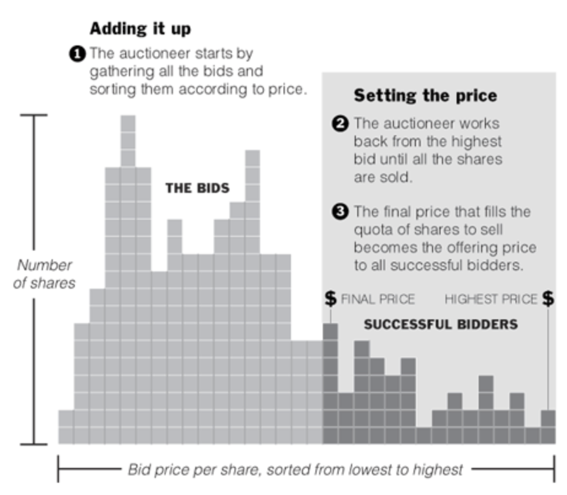

# EasyAuction

EasyAuction is a very simple DeFi building lego brick to run auctions for fair initial offerings and token buy back programs.
The EasyAuction platform is very simple and allows anyone to permissionlessly schedule batch auction without any charge of fees.

## Background

This project is non-profit project. The author has not deployed the code to mainnet, but it will likely be done by an unknown anonyms entity. The author does not give any guarantees about the project or is liable in any way.

## Use cases

### Initial token offering with a fair price-discovery

With this auction mechanism, projects, companies, DAOs and the like can offer their future stakeholders a fair participation within their ecosystem by acquiring tokens. One of the promises of DeFi is democratization and communitization of big corporate infrastructures to build open platforms for the public good. By running a batch auction, these projects facilitate a game theoretically fair way to distribute stakes to future participants. They have to chance demonstrate their interest in fair participation and setting a precedence for future processes by choosing this fair auction principles over private multi-stage sales.
Auction based mechanisms are also seen picking up in the traditional finance world. Google was one of the first big tech companies using very similar auction mechanism with a unique clearing price to IPO. Nowadays, companies like Slack and Spotify are advocating similar approaches as well via Direct Listings: Selling their stocks in the pre-open auction on the first day of trading.

### Token buy back programs

Many decentralized governance projects have to buy back their tokens or auctioning off their tokens to clear deficits within their protocol. This EasyAuction platform allows them to schedule individual auctions to facilitate these kind of operations.

### Initial credit offering

First implementations of [yTokens are live](https://defirate.com/uma-ycomp-shorts/) on the ethereum blockchain. The initial price finding and matching of creditor and debtor for such credit instruments can be done in a very fair manner for these kind of financial contracts.

## Protocol description

### The batch auction mechanism

In this auction type a pre-defined amount of tokens is auctioned off. Anyone can bid to buy these tokens by placing a buy-order with a specified limit price during the whole bidding time. At the end of the auction, the final price is calculated by the following method: The buy volumes from the highest bids are getting added up until this sum reaches the initial sell volume. The bid increasing the overall buy volume to is the bid defining the uniform clearing price. All bids with higher price will be settled and traded against the initial sell volume with the clearing price. All bids with a lower price will not be considered for the settlement. The principle is described best with the following diagram:


### Specific implementation batch auction

EasyAuction allows anyone to start a new auction of any ERC20 token (sellToken) against another ERC20 token (buyToken). The entity initiating the auction, the auctioneer, has to define the amount of token to be sold, the minimal price for the auction, and the end-time of the auction. Once the auctioneer initiates the auction with a ethereum transaction transfering the sellTokens and setting the parameters. From this moment on, anyone can participate as a buyer and submit bids. Each buyer places buy-orders with a specified limit price into the system. The buy amount of an order must be at least 1/5000th of the auctioned sell amount. Once an order is placed, orders can no longer be canceled and the tokens for the buying process are locked.
Once the auction ends, the final clearing price will be determined via an onchain calculation. The minimal buy amount per order is set in such a way that no more than 5000 orders need to be read onchain for the price calculation. This limit ensure that the onchain price can be calculated within one ethereum transaction. The transaction sender gets the transaction costs off-set by

Once the price of an auction has been caluclated onchain, everyone can claim their part of the auction. The auctioneer can withdraw the bought funds, the buyers being matched in the auction can withdraw their bought tokens. The buyers bidding with a too low price which were not matched in the auction can withdraw their bidding funds back.

## Comparison to Dutch auctions

The proposed batch auction system has a number of advantages over dutch auction.

- The biggest advantage is certainly that buyers don't have to wait for a certain time to submit orders, but that they can submit orders at any time. This makes the system much more convinient for users.
- Dutch auctions have a very high activity right before the auction is closing. If pieces of the infrastructure are not working reliable during this time period, then prices can fall further than expected, causing a loss for the auctioneer. Also, high gas prices during this short time period can be a hindering factor for buyers to quickly join the auction.
- Dutch auctions calculate their price based the blocktime. This pricing is hard to predict for all participants, as the mining is a stochastical process Additionally, the unpredictablity for the mining time of the next block
- Dutch auctions are causing a gas price bidding war to close the auction. In contrast in batch auction, different buyers will bid against other bidder in the mem-pool. Especially, once (EIP-1559)[https://eips.ethereum.org/EIPS/eip-1559] is implemented and the mining of a transaction is guaranteed for the next block, then bidders have to compete on bidding limit-prices instead of the gas-prices to get included into the auction.

## Instructions

### Backend

Install dependencies

```
git clone easyAuction
cd easyAuction
yarn
yarn build
```

Running tests:

```
ganache-cli  -l 8e8 -i 5777 -p 8545 -d
yarn test
```

### Frontend
